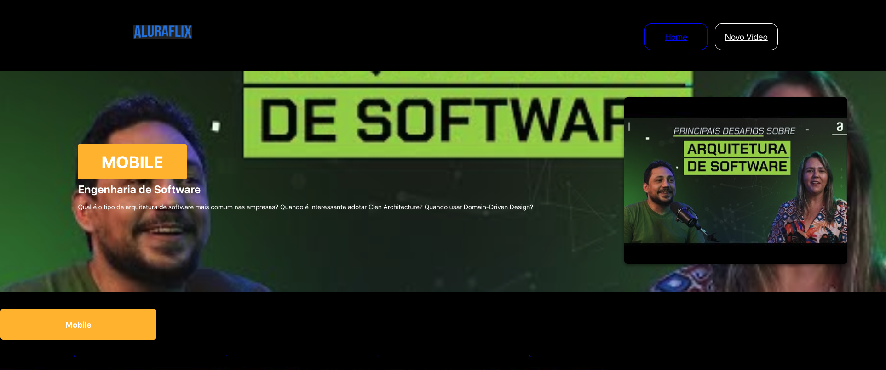
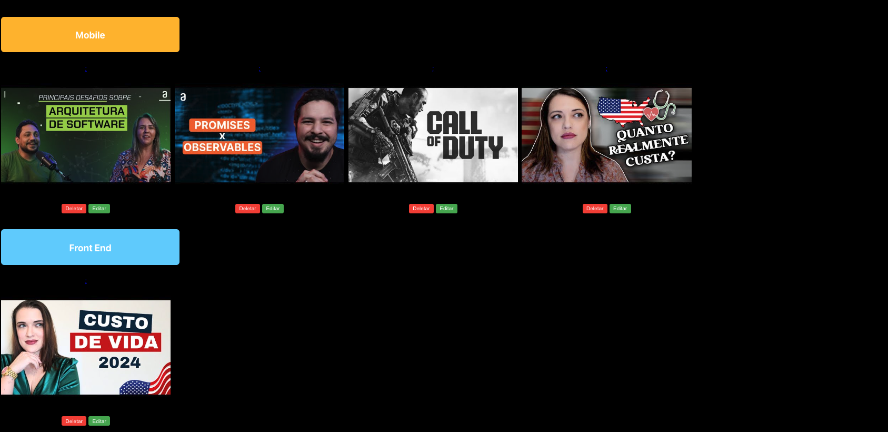
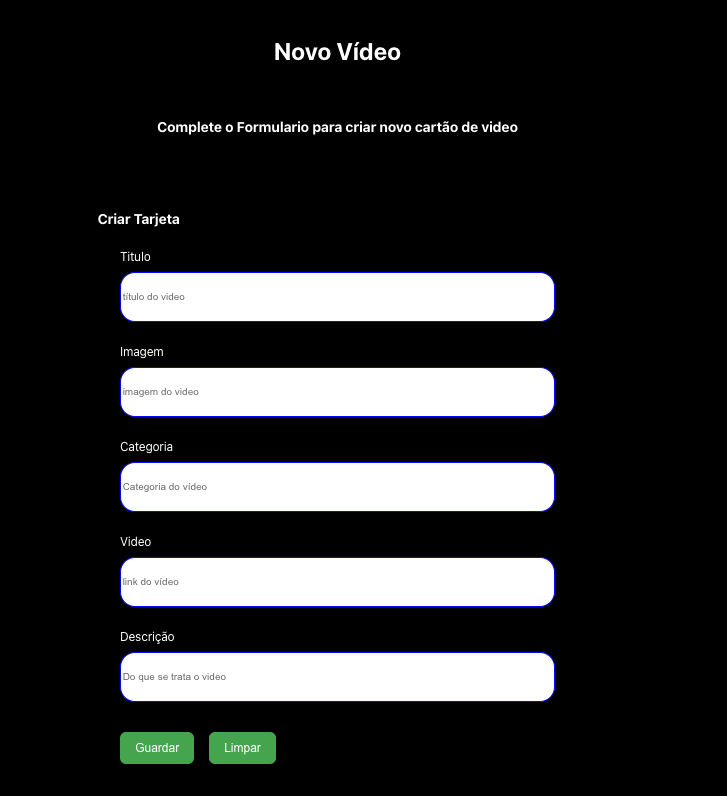

# Projeto AluraFlix

O projeto tem por objetivo desenvolver em REACT duas telas. A tela Início apresenta os vídeos cadastrados e a tela Novo Vídeo apresenta um formulario para cadastro de novo video.
Cada vídeo deve ter a possibilidade de ser editado por meio de um modal contendo os mesmos campos do cadastro.

## Demonstração

## Página Inicial

##Página de Cadastro

## Tecnologias Utilizadas

- React
- Node.js
- Javascript
- CSS
